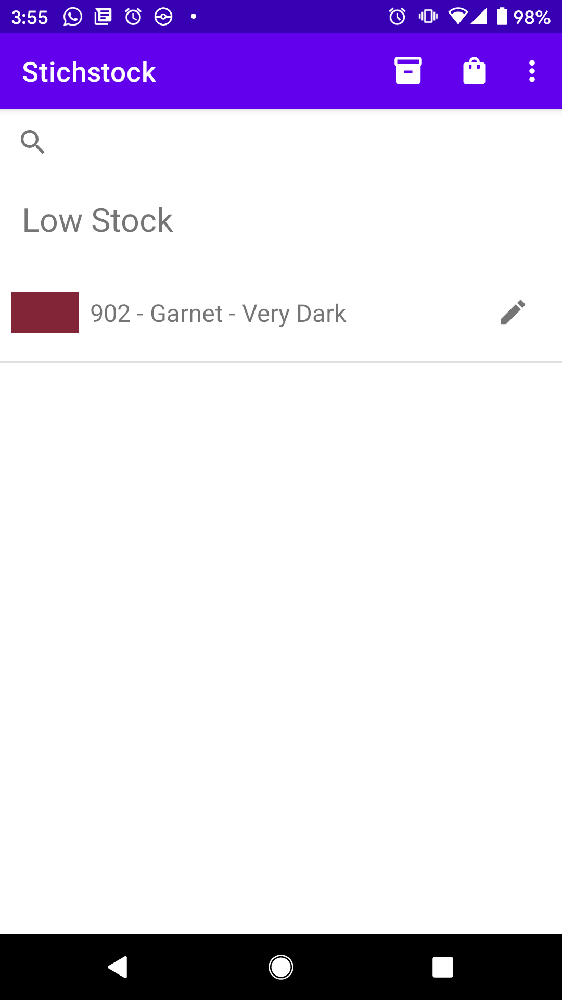

# Thread Management - Stichstock

## 1. Project Description
I have built an Android app called "Stichstock". This app is a way for embroiderers to keep track of how many skeins of embroidery thread (or floss) they have in their inventory. For this app, I have specifically used the standard list of DMC embroidery floss colors, their DMC ID #, and their Hex values. I have not used any other brand or DMC metallic, gradient, or varient colors. Expanding this list is not a part of the MVP.

### Background
Embroidery thread comes in skeins which can be wrapped around a holder called a bobbin. DMC skeins have 8 metres of floss, which can be split into 6 strands. Embroiderers can use 1 strand to 12 or more strands at once. So one skein could be the equivalent of 48 metres of thread maximum.

DMC have 507 colors in their standard list (their site currently lists 506 colors but their is 507 in my data set). Some projects call for dozens of different colors. It can be difficult to keep track of how many colors you may have after a few projects. Some apps exist to keep track of thread stock, but most are not user friendly or are overly complex for the normal user. As someone who has a growing collection of embroidery thread, I have long desired a simple mobile app to keep track of my stock.

Hex Codes taken from: [DMC Floss to RGB Values Conversion Chart](http://dmc.crazyartzone.com/index.asp)
Full list and names taken from: [Lord Libidan - DMC Spreadsheet Updated](https://lordlibidan.com/dmc-thread-inventory-spreadsheet/)
These were compiled into one CSV file. Some RGB values were taken from Lord Libidan for the missing colors in the conversion chart

## 2. Objective
For MVP:
- Search for colors by id #
- Add colors to your stock
- Mark a color in stock as "low stock"; user decides this - rares colors could hardly be used but 16 metres of black thread, for example, could be considered dangerously low in stock)
- Mark a color as needed (add to a shopping list); user decides this - could be a thread that's low in stock, in stock, or not in stock
- Remove colors from any of these lists
- Mark the # of skeins or bobbins of each color - used or unused. The app treats 1 skein as anywhere between nothing remaining and 8 full metres
- Save status of threads for later

For full product:
- track threads across projects (some project code prepared but not used for project)
- adding threads to projects can change their status
- Proper layouts for all 

## 3. Tech Stack and Build of Application
Front end and back end Android development using Java, xml, gradle. Built in Android Studio. Learned about Fragments in Android development for this project.

## 4. Running the Application
Install the apk file onto and android phone (make sure to enable installing from an unknown source).
OR Load the project files into Android studio and run on a smart phone emulator.
I have included a video file of the application running.

## 5. Test Cases

In the `Controller` class, there is a method called `testRandomFindThreads()` this method loads about a dozen colors. This method can be commented out to start with an empty stock list. (This will only run if there is no saved thread list in Shared Preferences.)

To view the In Stock List, click on the inventory button (first icon). (This is also the home screen of the app.)

To view the Shopping List, click on the shopping bag button (second icon). Should be empty by default.

Open the menu but pressing the vertical ellipses.

Click on Low Stock to view the Low Stock list. Should be empty by default.

In any of these views, you can click on the pencil icon next to a thread color to view the individual color.

In this view you can toggle:
- if the color is in stock
- if the color is low in stock
- if the color is needed (added to shopping list)

You can increase and decrease the number of skeins or bobbins in stock by pressing the minus and plus buttons

Things to test:
- A color must be in stock to be low in stock
- A color must have at least a quantity of 1 to be in stock or low in stock
- You cannot have a negative number of skeins/bobbins
- A color can be either in stock or not in stock to be needed
- If a color was not in stock and was needed, and is marked as in stock, the color will no longer be needed
- A color must have a quantity of 0 to be out of stock

Press the floating save button in the top right to save the thread state and return to the home view.

To search for a thread, you must know the id number. Click on the search bar.

Below is an example of what to expect when a color is not in the list.

Most colors are numbers ranging (but not inclusive - remember there are only 507! I didn't come up with this system!) from 1 to 3895. The full list is in the CSV file: [threadvalues2.csv](app/src/main/res/raw/threadvalues2.csv)

Example not in list: 2000.
Example in list: 3887.

Some alpha numeric colors exist. These are "White", "Blanc", "Ecru", and "B5200" - all variants of white.

Here is a gif of the app in use (there is also a full video).

## 6. Github Link
https://github.com/MagneticRegulus/ThreadManagementApp